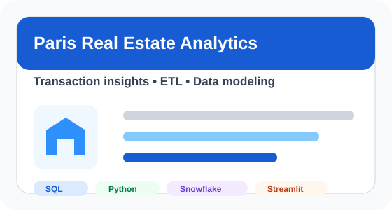
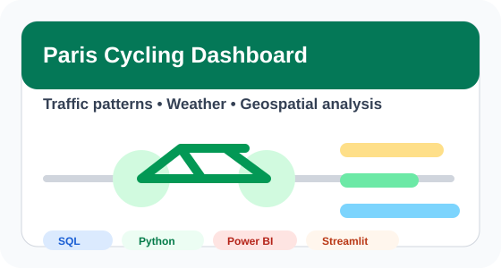

  

  <a href="https://www.linkedin.com/in/stefanialicciardi">LinkedIn</a> |
  <a href="https://github.com/stefanialicciardi-byte">GitHub</a> |
  <a href="https://paris-real-estate-analytics-i.streamlit.app/">Featured App</a>

## About Me

I combine 10+ years of experience in e-commerce and retail with hands-on training in analytics engineering, ETL development, SQL, Python, Snowflake, dbt, and business intelligence.

My background in buying, merchandising, assortment planning, supplier negotiation, and KPI analysis helps me approach data work with a strong understanding of business context. I enjoy translating commercial questions into clean data models, practical dashboards, and actionable insights.

I am especially interested in analytics engineering, business intelligence, retail analytics, and data products that help teams make better decisions.

## Core Skills

  
  
  
  
  
  

| Area | Tools & Skills |
| --- | --- |
| Data & Analytics | SQL, Python, Snowflake, dbt, ETL, data modeling, data warehousing |
| BI & Visualization | Power BI, Streamlit, dashboarding, data visualization, KPI reporting |
| Data Workflows | Data cleaning, API integration, transformation logic, geospatial analysis |
| Business Domain | E-commerce, retail analytics, buying, merchandising, assortment planning |

## Featured Projects

### Real Estate Analytics Platform 🏠

End-to-end analytics solution for exploring Paris real estate transactions, including ETL pipelines, analytical data models, public dataset integration, and a Streamlit app.

**Tech:** SQL, Python, Snowflake, ETL, Streamlit  
**Links:** [Live App](https://paris-real-estate-analytics-i.streamlit.app/) | [Repository](https://github.com/stefanialicciardi-byte/paris-real-estate-analytics)

### Cycling Traffic Analytics Dashboard 🚲

Dashboard for analyzing cycling traffic patterns in Paris by combining traffic, weather, calendar, and geospatial datasets.

**Tech:** SQL, Python, Power BI, Streamlit  
**Links:** [Live App](https://paris-cycling-dashboard-sw82zmv87tc5sxqluddjrj.streamlit.app/) | [Repository](https://github.com/stefanialicciardi-byte/paris-cycling-dashboard)

## Current Focus

- Building analytics engineering projects with SQL, Python, Snowflake, and dbt
- Designing clear dashboards and reporting workflows for business users
- Strengthening my portfolio with real-world data products
- Applying my e-commerce and retail background to data and BI roles

## Education & Training

**Analytics Engineering, ETL & Data Analysis**  
Liora | 2026

**MSc Innovation, Knowledge and Entrepreneurial Dynamics**  
Aalborg University Business School | 2011 - 2013

**BSc Business Administration**  
Università degli Studi della Basilicata | 2007 - 2010

## Professional Background

I bring current freelance experience as a Data Analyst and Analytics Engineer at Essential Depilazione Laser, combined with 10+ years of fashion e-commerce and retail experience from BestSecret and Zalando. This background helps me translate commercial and operational challenges into data-driven decisions, with a strong understanding of KPI analysis, stakeholder needs, reporting workflows, and scalable analytics solutions.

**Technologies:** PostgreSQL, SQL, Python, Pandas, dbt, Metabase, REST APIs

| Role | Company | Focus |
| --- | --- | --- |
| Data Analyst / Analytics Engineer | Essential Depilazione Laser | PostgreSQL analysis, Metabase dashboards, dbt models, Python automation, REST API integration, data validation, KPI reporting, and stakeholder reporting workflows |
| Buyer | BestSecret Group | Multi-million-euro product portfolio management, sales trend analysis, revenue and margin KPIs, supplier negotiations, and assortment strategy |
| Buyer | brands4friends | Multi-category buying, supplier sourcing and negotiations, commercial campaign planning, inventory analysis, KPI monitoring, and junior team mentoring |
| Junior Buyer | Zalando | Brand portfolio management, marketplace and wholesale partnerships, in-season management, and trend analysis |
| Merchandise Planning Assistant | Zalando | Stock monitoring, delivery tracking, reorders, weekly trade analysis, and operational issue resolution |

This commercial background helps me bridge the gap between business teams and technical data work: I understand both the questions stakeholders ask and the data structures needed to answer them well.

## Let's Connect

I am open to opportunities in analytics engineering, data analysis, ETL development, and business intelligence.

- LinkedIn: [linkedin.com/in/stefanialicciardi](https://www.linkedin.com/in/stefanialicciardi)
- GitHub: [github.com/stefanialicciardi-byte](https://github.com/stefanialicciardi-byte)
